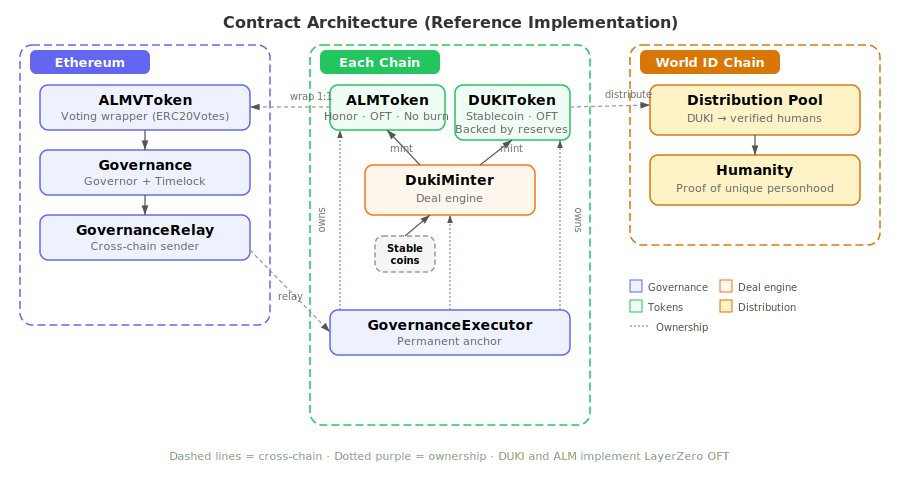

# DukerNews

**On-chain Web3 community empowering DUKI /djuːki/ (Decentralized Universal Kindness Income)**

> Every voluntary deal can generate universal income. No charity, no taxation — just voluntary commerce that benefits everyone.

🔗 **Live**: [dukernews.xyz](https://dukernews.xyz)  
📄 **Whitepaper**: [DUKI Protocol](apps/webapp/draft/whitepaper/md/v3.md)  
🐦 **Twitter**: [@dukernews](https://x.com/dukernews)

---

## What is DukerNews?

DukerNews is a HackerNews-style Web3 content platform deployed on **X Layer**. Every interaction — posting, commenting, upvoting, and boosting (tipping) — is recorded permanently on-chain.

The core innovation: **every USDT boost (tip) mints DUKI** — a stablecoin distributed as universal income to all verified humans — plus **ALM governance tokens** for both the tipper and the content creator.

## How It Works

```
┌─────────────┐     USDT Boost      ┌──────────────────┐
│   Tipper     │ ──────────────────► │  DukerNews       │
│   (Taker)    │                     │  Smart Contract  │
└─────────────┘                     └────────┬─────────┘
                                             │
                              ┌──────────────┼──────────────┐
                              ▼              ▼              ▼
                        ┌──────────┐  ┌──────────┐  ┌──────────┐
                        │  DUKI    │  │   ALM    │  │   ALM    │
                        │ Treasury │  │  50%     │  │  50%     │
                        │ (for all │  │  Tipper  │  │  Creator │
                        │ humans)  │  │          │  │          │
                        └──────────┘  └──────────┘  └──────────┘
```

1. **Post** your project — it goes on-chain, permanent and uncensorable
2. **Boost** (tip) with USDT — funds flow to the DUKI Treasury
3. **DUKI** is minted and distributed to all verified humans
4. **ALM** governance tokens are minted — 50% to tipper, 50% to creator
5. **Comment & Upvote** — all interactions are on-chain

## Key Features

| Feature | Description |
|---------|-------------|
| 📝 **On-chain Content** | Posts, comments, and upvotes stored permanently on X Layer |
| 💰 **USDT Boost** | Tip content creators with USDT, triggering DUKI/ALM minting |
| ⚡ **Gasless via x402** | Zero-gas posting and username minting through x402 protocol |
| 🔐 **Username NFT** | On-chain soul-bound NFT as your identity |
| 🏛️ **ALM Governance** | Governance tokens earned through participation, not purchased |
| 🤖 **AI Agent** | Autonomous content evaluation and boosting via OnchainOS Wallet |

## Architecture



### Smart Contracts (X Layer Mainnet)

| Contract | Address |
|----------|---------|
| **DukerNews (Proxy)** | [`0x348C88cC171bffDB9128bc9DEcDa49c0820FB29F`](https://www.oklink.com/xlayer/address/0x348C88cC171bffDB9128bc9DEcDa49c0820FB29F) |
| DukerNews (Impl) | [`0x565C8206D626dc9Ddee7f1958A96602cA5dAd32c`](https://www.oklink.com/xlayer/address/0x565C8206D626dc9Ddee7f1958A96602cA5dAd32c) |


### Tech Stack

- **Blockchain**: Solidity, Foundry, X Layer (EVM)
- **Frontend**: TanStack Start (SSR), React, Viem, Wagmi
- **Backend**: Cloudflare Workers, D1 Database
- **Protocol**: ConnectRPC, Protobuf
- **Tokens**: ERC-20 (DUKI, ALM), ERC-721 (Username SBT), LayerZero OFT
- **Payments**: USDT (USD₮0), x402 gasless protocol
- **Wallet**: WalletConnect

## Repository Structure

```
├── apps/
│   ├── webapp/             # Main web application (TanStack Start + Cloudflare Workers)
│   └── duker-agent/        # AI agent terminal client (WIP, not finished yet)
├── packages/
│   ├── contract_duki_alm_world/   # DUKI & ALM token contracts (git submodule)
│   ├── contract-duker-dao/        # DukerNews core contract + BaguaDao
│   ├── apidefs/                   # Protobuf API definitions
│   └── dao-bagua-diagram/         # Interactive Bagua diagram component
└── onchainos-skills/              # OnchainOS skills (git submodule)
```

## OnchainOS Integration

- **x402 Payments** — Gasless username minting and post submission
- **Wallet API** — AI agent uses OnchainOS Agentic Wallet for autonomous payments
- **DApp Wallet Connect** — Browser wallet connection via WalletConnect

## The DUKI Protocol

DUKI (Decentralized Universal Kindness Income) is a protocol where ordinary commerce generates universal income:

- **Makers** market by voluntarily pledging a fraction of deal surplus on-chain
- **Takers** evaluate trust through on-chain contribution history (ALM)
- **Everyone** receives DUKI — a stablecoin backed 1:1 by reserve stablecoins
- **No benefactor needed** — as long as deals occur, universal income is generated

> *"Universal income is not a gift from the powerful to the powerless — it is the natural yield of cooperative commerce."*

## Getting Started

### Prerequisites

- Node.js v22+
- pnpm v10+
- Foundry (for smart contracts)

### Install & Run

```bash
pnpm install
pnpm dev
```

## License

**DUKI License** — Free to use, modify, and distribute. Any commercial entity using this software must pledge at least 1% of profits to the DUKI protocol.

---

*Built on [X Layer](https://www.okx.com/xlayer) for the X Layer Onchain OS AI Hackathon*
